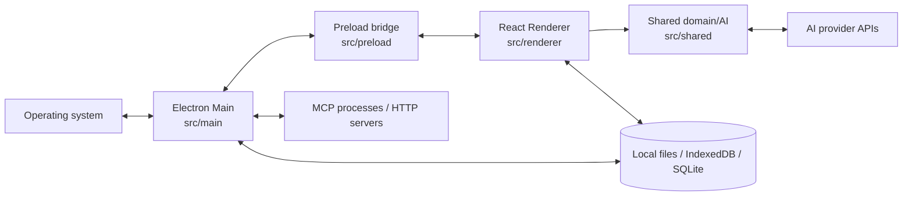
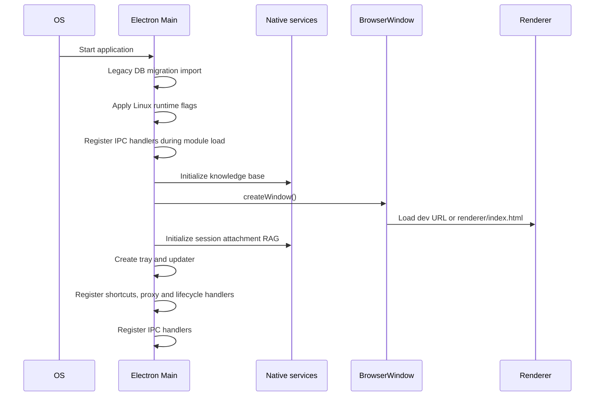
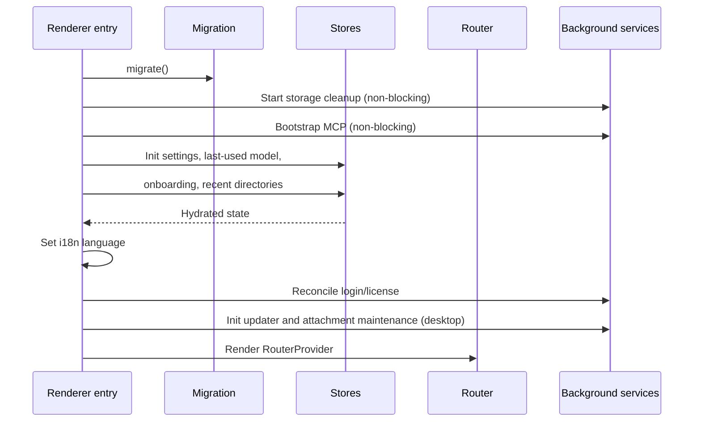
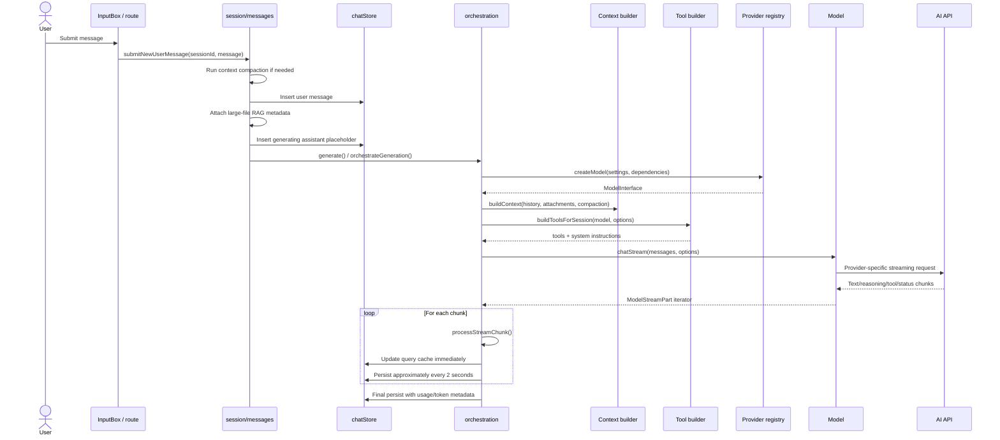
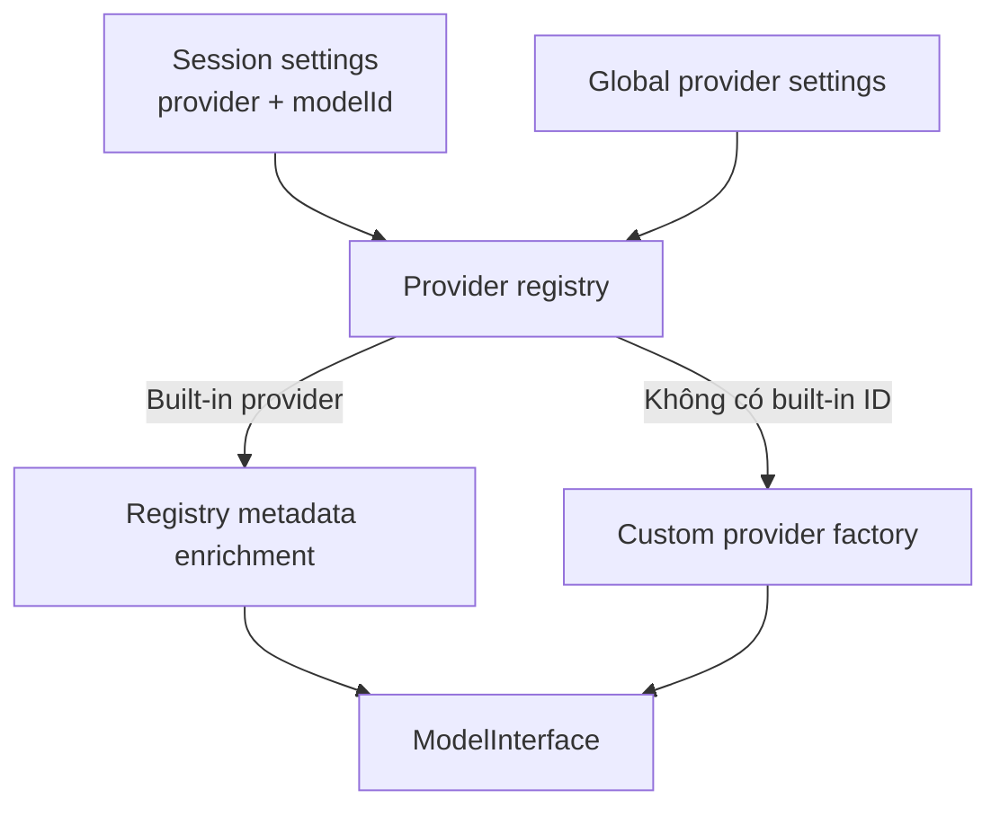

# Kiến trúc MegaChat (Chatbox Community Edition)

> Tài liệu dành cho người mới tham gia phát triển. Nội dung mô tả cấu trúc hiện tại của codebase, ranh giới giữa các lớp và những luồng hoạt động quan trọng.

## 1. Tổng quan

MegaChat là ứng dụng chat đa nền tảng cho nhiều nhà cung cấp AI. Cùng một lớp giao diện React được đóng gói cho ba môi trường:

- **Desktop**: Electron trên Windows, macOS và Linux.
- **Web**: SPA chạy trực tiếp trong trình duyệt.
- **Mobile**: ứng dụng Capacitor cho iOS và Android.

Các mục tiêu kiến trúc chính:

1. Dùng chung phần lớn UI và nghiệp vụ giữa các nền tảng.
2. Cô lập khả năng native sau một lớp `Platform`.
3. Chuẩn hóa nhiều API AI khác nhau qua provider registry và `ModelInterface`.
4. Lưu dữ liệu theo hướng local-first, nhưng chọn backend lưu trữ phù hợp cho từng nền tảng.
5. Xử lý phản hồi AI theo stream, cập nhật UI nhanh nhưng vẫn định kỳ lưu bền vững.

## 2. Công nghệ chính

| Khu vực | Công nghệ |
|---|---|
| Desktop runtime | Electron |
| Web/mobile UI | React 18, TypeScript |
| Build | electron-vite, Vite |
| Routing | TanStack Router, file-based routes |
| Server-state/cache | TanStack Query |
| Client-state | Zustand và Jotai |
| UI | Mantine, MUI, Tailwind CSS |
| AI abstraction | Vercel AI SDK và các provider SDK |
| Desktop persistence | electron-store, IndexedDB/localforage, file/blob storage |
| Mobile persistence | Capacitor SQLite và localforage cho blob |
| Web persistence | IndexedDB/localforage |
| Native mobile shell | Capacitor |
| Tests | Vitest |
| Lint/format | Biome |
| Packaging | electron-builder |

Nguồn cấu hình chính: `package.json`, `electron.vite.config.ts`, `electron-builder.yml`, `vitest.config.ts`.

## 3. Mô hình tiến trình và ranh giới tin cậy

### 3.1 Desktop/Electron



- **Main process** (`src/main/main.ts`) quản lý cửa sổ, tray, menu, deep link, updater, proxy, parser file, OAuth, MCP stdio, sandbox, skills, knowledge base và các IPC handler native.
- **Preload** (`src/preload/index.ts`) chỉ công khai một bridge có kiểu là `window.electronAPI`; renderer không import trực tiếp Electron API.
- **Renderer** (`src/renderer/`) chứa React UI, routing, state, storage facade và orchestration cho chat.
- **Shared** (`src/shared/`) chứa kiểu dữ liệu, context builder, model/provider abstraction, OAuth helpers và các utility không phụ thuộc React.

### 3.2 Web và mobile

Web/mobile không có Electron Main hoặc preload. Renderer chọn implementation khác của `Platform`:

```text
Test               -> TestPlatform
CHATBOX_BUILD_TARGET=mobile_app -> MobilePlatform
window.electronAPI tồn tại       -> DesktopPlatform
còn lại                         -> WebPlatform
```

Điểm chọn nằm ở `src/renderer/platform/index.ts`. Vì vậy code nghiệp vụ nên gọi interface `Platform`, không tự kiểm tra hay gọi trực tiếp Electron/Capacitor trừ phần adapter nền tảng.

## 4. Phân lớp codebase

```text
src/
├── main/                 Electron Main và các dịch vụ native
├── preload/              IPC bridge an toàn cho renderer
├── renderer/
│   ├── routes/           Route TanStack theo file
│   ├── components/       UI dùng lại
│   ├── stores/           Session, settings, task và UI state
│   ├── packages/         Các subsystem phía renderer
│   ├── platform/         Adapter desktop/web/mobile/test
│   ├── storage/          Storage facade và metadata stores
│   ├── adapters/         Ghép dependency cho shared model layer
│   └── setup/            Khởi tạo analytics, MCP, migration, token...
└── shared/
    ├── context/          Xây dựng context gửi model
    ├── models/           ModelInterface và model base classes
    ├── providers/        Provider registry và provider definitions
    ├── model-registry/   Metadata/capability của model
    ├── oauth/            OAuth credential resolution dùng chung
    ├── types/            Domain types
    └── utils/            Utility thuần
```

Các thư mục cấp cao khác:

| Đường dẫn | Vai trò |
|---|---|
| `docs/` | Tài liệu kỹ thuật và sản phẩm |
| `test/integration/` | Integration tests cho context, file conversation và provider |
| `scripts/` | Script tạo snapshot, đánh giá RAG và bảo trì |
| `release/app/` | Package runtime được electron-builder đóng gói |
| `assets/`, `resources/`, `icons/` | Tài nguyên ứng dụng và installer |
| `team-sharing/` | Hạ tầng chia sẻ API trong nhóm |

## 5. Luồng khởi động

### 5.1 Electron Main

Entry point build là `src/main/main.ts`.



Chi tiết quan trọng:

- Migration database cũ được import trước khi Electron `app` khởi tạo.
- Các IPC handler được đăng ký khi module Main được nạp; dịch vụ phụ thuộc `app.whenReady()` chỉ chạy sau đó.
- Main đợi knowledge base trước khi tạo cửa sổ.
- Sau khi tạo cửa sổ, Main khởi tạo session-attachment RAG, tray, updater, shortcut và proxy.
- Deep links dùng scheme `chatbox://` trong production và `chatbox-dev://` trong development.
- Khi thoát, ứng dụng đóng MCP transports, unregister shortcut và hủy tray.

### 5.2 Renderer

Entry point UI là `src/renderer/index.tsx`.



Nếu migration kéo dài hơn một giây, UI hiển thị trang log khởi tạo. Các lỗi migration được ghi log và gửi Sentry nhưng không ngăn ứng dụng cố gắng render.

Root route (`src/renderer/routes/__root.tsx`) tiếp tục:

- hydrate settings/onboarding nếu cần;
- prefetch model registry;
- tải remote config;
- chuyển người dùng mới sang `/guide` khi chưa cấu hình provider;
- khôi phục session gần nhất nếu `startupPage === 'session'`;
- đồng bộ route với chế độ sidebar;
- cài theme, i18n, shortcut, modal và analytics.

## 6. Routing và bố cục UI

TanStack Router sinh `src/renderer/routeTree.gen.ts` từ `src/renderer/routes/`.

Các route chính:

| Route | Chức năng |
|---|---|
| `/` | Tạo cuộc trò chuyện mới |
| `/session/$sessionId` | Cuộc trò chuyện hiện có |
| `/task`, `/task/$taskId` | Task/agent session |
| `/image-creator` | Sinh ảnh |
| `/copilots/*` | Danh sách và cấu hình copilot |
| `/settings/*` | Cấu hình chung, provider, MCP, skills, knowledge base... |
| `/guide` | Onboarding |
| `/about` | Thông tin ứng dụng |
| `/dev/*` | Công cụ hỗ trợ development |

Desktop/mobile dùng hash history; web dùng browser history. Route không tồn tại được chuyển về `/`.

Root layout bao gồm:

```text
Root providers
├── Mantine/MUI theme providers
├── Modal and toast infrastructure
├── Sidebar
└── Route Outlet
    ├── Header
    ├── MessageList/content
    └── InputBox/actions
```

## 7. Mô hình state

Không có một global store duy nhất. Codebase chia state theo bản chất dữ liệu:

| Công cụ | Dùng cho |
|---|---|
| TanStack Query | Session, session metadata và dữ liệu async có cache |
| Zustand | Settings, onboarding, UI, model gần nhất, task sessions, updater |
| Jotai | Một số atom khởi tạo, session/UI state nhỏ và tương thích code cũ |
| Component state | Draft UI hoặc state chỉ tồn tại trong một màn hình |
| Persistent storage | Session, settings, configs, blob/file và metadata |

`src/renderer/stores/chatStore.ts` là data-access layer cho session. Nó:

- đọc/ghi session qua storage facade;
- giữ cache session trong TanStack Query;
- phân trang session metadata;
- dùng `UpdateQueue` riêng theo session để tuần tự hóa ghi và tránh race;
- cập nhật cả persistent store, metadata store và query cache.

## 8. Kiến trúc lưu trữ

### 8.1 Ma trận nền tảng

| Nền tảng | Settings/configs | Session body | Session metadata | Blob/file |
|---|---|---|---|---|
| Desktop | File qua Electron IPC | IndexedDB/localforage | IndexedDB | File/blob qua Main IPC |
| Web | IndexedDB | IndexedDB | IndexedDB | IndexedDB/localforage |
| Mobile | Capacitor SQLite | Capacitor SQLite | SQLite | localforage |

Desktop chủ động giữ `configs`, `settings`, `configVersion` trong file để dễ backup; dữ liệu session dung lượng lớn ở IndexedDB. Logic nằm trong `DesktopPlatform.needStoreInFile()`.

### 8.2 Khóa dữ liệu

Các khóa phổ biến trong `src/renderer/storage/StoreStorage.ts`:

- `session:<id>`: nội dung một session;
- `chat-sessions-list`: danh sách/metadata lịch sử;
- `settings`, `configs`, `configVersion`: cấu hình;
- `file:<sessionId>:<messageId>:<uuid>`: file attachment;
- `picture:<category>:<uuid>`: ảnh;
- `link:<url>`: nội dung link đã parse.

### 8.3 Ghi session

Tạo session thực hiện theo thứ tự:

1. Sinh UUID và hợp nhất model gần nhất vào session settings.
2. Ghi session body.
3. Tạo bản ghi metadata với `sortOrder` và `createdAt`.
4. Cập nhật cache danh sách đã phân trang.

Khi sửa session, `UpdateQueue` bảo đảm các update cùng session không ghi đè lẫn nhau. Sau đó metadata và React Query cache được cập nhật đồng bộ.

Xem thêm: [`storage.md`](./storage.md).

## 9. Luồng gửi tin nhắn và nhận stream

Đây là luồng nghiệp vụ trung tâm.



### 9.1 Tạo session mới

Route `/` giữ một session tạm có ID `new`. Khi submit lần đầu:

1. `createSession()` tạo session thật.
2. Knowledge base và web-browsing state tạm được chuyển sang ID mới.
3. `switchCurrentSession()` điều hướng tới session vừa tạo.
4. `submitNewUserMessage()` bắt đầu luồng gửi/generate.

Trong route `/session/$sessionId`, submit gọi thẳng `submitNewUserMessage()` cho session hiện tại.

### 9.2 Chuẩn bị trước khi gọi model

`orchestrateGeneration()` thực hiện:

1. Đọc session, session settings, global settings và config.
2. Tạo placeholder assistant ở trạng thái `generating` và gắn `AbortController`.
3. Tạo model qua adapter/provider registry.
4. Refresh trạng thái attachment RAG trên desktop.
5. Xây context theo lịch sử, compaction points và giới hạn message.
6. Nếu model không hỗ trợ vision, chạy OCR khi có thể.
7. Áp dụng fallback cho model/tool cũ.
8. Chọn tools dựa trên capability và cấu hình session.
9. Inject system prompt/tool instructions.
10. Chuyển domain messages sang định dạng AI SDK và bắt đầu `chatStream()`.

### 9.3 Xử lý stream

Mỗi stream chunk được `stream-chunk-processor.ts` chuyển thành message content parts như text, reasoning, tool call, file, status, finish reason và usage.

Để cân bằng độ mượt và độ bền dữ liệu:

- mỗi chunk cập nhật React Query cache ngay;
- khoảng mỗi 2 giây mới ghi persistent storage;
- khi kết thúc, bị hủy hoặc lỗi luôn có một lần final persist;
- `cancel()` gọi `AbortController.abort()`;
- lỗi được chuẩn hóa thành dữ liệu trên assistant message để UI render.

## 10. Provider và model abstraction

Provider registry nằm trong `src/shared/providers/`.



Cơ chế:

1. `src/shared/providers/index.ts` side-effect import từng provider definition.
2. Mỗi definition gọi `defineProvider()` để đăng ký ID, default settings và `createModel()`.
3. `getModel()` tìm built-in definition; nếu không có thì thử custom provider.
4. Model metadata được enrich từ model registry để xác định capability, context window và max output.
5. Kết quả cuối cùng luôn tuân theo `ModelInterface`/`chatStream()`.

Provider ID là khóa điều phối xuyên suốt settings, runtime, OAuth và UI; built-in và custom provider không được trùng ID.

Xem chi tiết: [`technical/ai-providers.md`](./technical/ai-providers.md).

## 11. Tool, MCP, knowledge base và skills

`buildToolsForSession()` ở `src/renderer/stores/session/tools-builder.ts` hợp nhất các nguồn tool:

- tools từ MCP servers đang chạy;
- web search và `parse_link`;
- đọc/search file đính kèm;
- session attachment RAG;
- knowledge base RAG;
- sandbox cho Task mode;
- `load_skill` và chạy script của skill khi session bật skills.

Tool chỉ được thêm khi model khai báo capability tương ứng. Mô tả toolset cũng được ghép vào system instructions để model biết cách sử dụng.

### MCP

- HTTP/SSE MCP có thể chạy trực tiếp từ renderer.
- Stdio MCP trên desktop đi qua Renderer -> preload IPC -> Main -> child process.
- `mcpController` quản lý lifecycle, trạng thái và namespace tool.

### File và RAG

- File nhỏ có thể được đưa trực tiếp vào context.
- File lớn có thể dùng file tools hoặc session-attachment RAG.
- Knowledge base và session attachment RAG trên desktop dùng dịch vụ/database ở Main process.
- Web hiện không triển khai knowledge base/session attachment RAG native.

### Task mode

Task mode dùng storage/session riêng nhưng tái sử dụng provider factory, tool builder và stream processor của chat thường:

1. `submitTaskMessage()` chạy compaction theo kiểu best-effort, rồi lưu user message và assistant placeholder.
2. Model được chọn theo thứ tự: settings của task -> model task dùng gần nhất -> default chat model -> chat model dùng gần nhất.
3. Nếu task có working directory, renderer yêu cầu platform khởi tạo sandbox cho thư mục đó.
4. `buildTaskSystemPrompt()` tạo system prompt; `buildToolsForSession()` bật sandbox, web browsing và skills.
5. `model.chatStream()` phát chunk qua cùng `processStreamChunk()` như chat thường.
6. Chunk cập nhật TanStack Query cache; kết quả cuối hoặc lỗi được ghi vào task storage.
7. Chỉ một task được generate tại một thời điểm. Cancel sẽ abort stream và yêu cầu platform kill sandbox process.

Luồng chính nằm trong `src/renderer/stores/taskSessionActions.ts`.

Xem chi tiết: [`technical/tools-and-integrations.md`](./technical/tools-and-integrations.md) và [`rag.md`](./rag.md).

## 12. IPC và native services

`src/preload/index.ts` expose `ElectronIPC` qua `contextBridge`. Renderer gọi `DesktopPlatform`, sau đó adapter gọi `ipc.invoke()`.

Các nhóm IPC chính:

| Nhóm | Ví dụ |
|---|---|
| Store/blob | `getStoreValue`, `setStoreValue`, `getStoreBlob` |
| App/system | version, platform, arch, locale, theme |
| Window | minimize, maximize, close, fullscreen |
| File/parser | parse local file, MinerU |
| Updater | check, progress, downloaded, install |
| OAuth | login callback, token operations |
| MCP | stdio transport lifecycle |
| Sandbox | process/file operations cho Task mode |
| Knowledge/RAG | index, query, maintenance |
| Skills | discover, install, load, execute script |

### Auto-update desktop

`AppUpdater` trong Main dùng `electron-updater` và gửi trạng thái về Zustand `updateStore` qua các event `updater:*`:

```text
idle -> checking -> up-to-date
                 -> available -> downloading -> downloaded
                 -> error
```

- Nếu `autoUpdate` bật, ứng dụng kiểm tra lần đầu sau 5 giây và lặp mỗi giờ.
- Năm feed URL được thử lần lượt; lỗi trung gian bị ẩn để UI chỉ nhận lỗi cuối cùng.
- Update được tự tải và có thể cài khi thoát hoặc khi renderer gọi `install-update`.
- Web/mobile không khởi tạo listener của Electron updater.

Xem chi tiết: [`technical/auto-updater.md`](./technical/auto-updater.md).

Khi thêm native capability mới, cần giữ chuỗi kiểu nhất quán:

```text
shared ElectronIPC type
  -> preload bridge
  -> Main ipcMain handler
  -> DesktopPlatform method
  -> renderer caller
```

## 13. Build và phân phối

`electron.vite.config.ts` định nghĩa ba bundle:

- Main entry: `src/main/main.ts`;
- Preload entry: `src/preload/index.ts`;
- Renderer entry: HTML/React, với route generation và code splitting.

Biến build chọn target:

| Biến | Ý nghĩa |
|---|---|
| `CHATBOX_BUILD_PLATFORM=web` | Web SPA |
| `CHATBOX_BUILD_TARGET=mobile_app` | Capacitor mobile |
| `CHATBOX_BUILD_PLATFORM=ios/android` | Nền tảng mobile cụ thể |
| Không đặt các biến trên | Electron desktop |

Các lệnh thường dùng:

```bash
pnpm run dev
pnpm run dev:web
pnpm run build
pnpm run build:web
pnpm run mobile:sync:ios
pnpm run mobile:sync:android
pnpm run package
```

Electron Builder tạo NSIS cho Windows, DMG/app cho macOS, AppImage và deb cho Linux. Cấu hình nằm trong `electron-builder.yml`.

## 14. Kiểm thử và quality gates

```bash
pnpm run test
pnpm run lint
pnpm run check
pnpm run build
```

- Vitest quét unit tests trong `src/` và integration tests trong `test/integration/`.
- `test:model-provider` chạy riêng vì cần cấu hình/network phù hợp.
- Alias test/build thống nhất: `@` trỏ tới renderer và `@shared` trỏ tới shared.
- Contract tests của provider registry khóa các invariant như provider ID duy nhất và mapping model registry.

Xem thêm: [`testing.md`](./testing.md).

## 15. Điểm mở rộng phổ biến

### Thêm provider

1. Thêm provider definition trong `src/shared/providers/definitions/`.
2. Thêm model implementation trong `definitions/models/` nếu không dùng class có sẵn.
3. Side-effect import definition trong `providers/index.ts`.
4. Thêm/cập nhật model registry mapping và tests.
5. Thêm UI/settings metadata nếu cần.

Xem [`adding-new-provider.md`](./adding-new-provider.md).

### Thêm route/tính năng UI

1. Tạo file route trong `src/renderer/routes/`.
2. Đặt UI dùng lại trong `components/`, nghiệp vụ tái sử dụng trong `packages/` hoặc `stores/`.
3. Không gọi native API trực tiếp; mở rộng `Platform` nếu tính năng khác nhau theo nền tảng.

### Thêm Electron capability

1. Mở rộng `ElectronIPC` shared type.
2. Expose listener/helper cần thiết trong preload.
3. Đăng ký Main handler.
4. Bọc bằng `DesktopPlatform`.
5. Cung cấp fallback/no-op rõ ràng cho Web/Mobile/Test.

### Thêm tool

1. Tạo toolset hoặc tích hợp vào subsystem thích hợp.
2. Khai báo capability gate.
3. Hợp nhất tool và instructions trong `buildToolsForSession()`.
4. Bảo đảm abort signal và lỗi có thể render cho người dùng.
5. Thêm tests cho điều kiện inject và execution.

## 16. Quy tắc phụ thuộc nên giữ

```text
renderer UI/routes
    ↓
renderer stores/packages/platform adapters
    ↓
shared domain/models/providers

Electron renderer -> preload bridge -> Electron Main -> OS/native services
```

Các nguyên tắc thực tế:

- `src/shared` không nên phụ thuộc React, Electron Main hoặc DOM-specific UI.
- Route/component không nên tự triển khai persistence hay provider protocol.
- Nghiệp vụ đa nền tảng phải đi qua `Platform` hoặc dependency adapter.
- Provider-specific protocol nằm sau `ModelInterface`, không rò vào UI.
- Update stream phải cập nhật cache nhanh và lưu bền theo nhịp, tránh ghi storage trên mọi token.
- Generated files như `routeTree.gen.ts` và model snapshot không chỉnh tay.

## 17. Bản đồ đọc code đề xuất

Để hiểu codebase nhanh, đọc theo thứ tự:

1. `package.json` — stack và scripts.
2. `electron.vite.config.ts` — các entry point và target build.
3. `src/main/main.ts` — lifecycle desktop và IPC.
4. `src/preload/index.ts` — ranh giới Main/Renderer.
5. `src/renderer/index.tsx` — bootstrap UI.
6. `src/renderer/routes/__root.tsx` và `routes/index.tsx` — layout và session mới.
7. `src/renderer/routes/session/$sessionId.tsx` — màn hình chat.
8. `src/renderer/stores/session/messages.ts` — submit message.
9. `src/renderer/stores/session/orchestration.ts` — AI pipeline.
10. `src/shared/providers/index.ts` — model/provider factory.
11. `src/renderer/platform/` và `storage/` — khác biệt nền tảng và persistence.
12. Tài liệu subsystem trong `docs/technical/`.

---

Tài liệu này ưu tiên mô tả kiến trúc đang chạy trong source code. Các tài liệu kế hoạch trong `tasks/`, `features/`, `openspec/` hoặc `docs/plans/` có thể mô tả trạng thái tương lai và không nên được coi là implementation hiện tại nếu chưa đối chiếu source.
